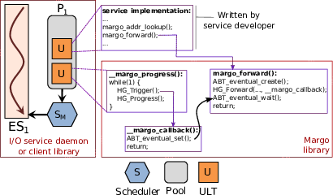

# Margo


[](https://codecov.io/gh/mochi-hpc/mochi-margo)

Margo provides Argobots-aware bindings to the Mercury RPC library.

Mercury (https://mercury-hpc.github.io/) is a remote procedure call
library optimized for use in HPC environments.  Its native API presents a
callback-oriented interface to manage asynchronous operation.  Argobots
(https://www.argobots.org/) is a user-level threading package.

Margo combines Mercury and Argobots to simplify development of distributed
services.  Mercury operations are presented as conventional blocking
operations, and RPC handlers are presented as sequential threads.  This
configuration enables high degree of concurrency while hiding the
complexity associated with asynchronous communication progress and callback
management.

Internally, Margo suspends callers after issuing a Mercury operation, and
automatically resumes them when the operation completes.  This allows
other concurrent user-level threads to make progress while Mercury
operations are in flight without consuming operating system threads.
The goal of this design is to combine the performance advantages of
Mercury's native event-driven execution model with the progamming
simplicity of a multi-threaded execution model.

A companion library called abt-io provides similar wrappers for POSIX I/O
functions: https://github.com/mochi-hpc/mochi-abt-io

Note that Margo should be compatible with any Mercury network
transport (NA plugin).  The documentation assumes the use of
the NA SM (shared memory) plugin that is built into Mercury for
simplicity.  This plugin is only valid for communication between
processes on a single node.  See [Using Margo with other Mercury NA
plugins](##using-margo-with-other-mercury-na-plugins) for information
on other configuration options.

##  Spack

The simplest way to install Margo is by installing the "mochi-margo" package
in spack (https://spack.io/).

##  Dependencies

* mercury  (git clone --recurse-submodules https://github.com/mercury-hpc/mercury.git)
* argobots (git clone https://github.com/pmodels/argobots.git)

### Recommended Mercury build options

* Mercury must be compiled with -DMERCURY_USE_BOOST_PP:BOOL=ON to enable the
  Boost preprocessor macros for encoding.
* Mercury should be compiled with -DMERCURY_USE_SELF_FORWARD:BOOL=ON in order to enable
  fast execution path for cases in which a Mercury service is linked into the same
  executable as the client

Example Mercury compilation:

```
mkdir build
cd build
cmake -DMERCURY_USE_SELF_FORWARD:BOOL=ON \
 -DBUILD_TESTING:BOOL=ON -DMERCURY_USE_BOOST_PP:BOOL=ON \
 -DCMAKE_INSTALL_PREFIX=/home/pcarns/working/install \
 -DBUILD_SHARED_LIBS:BOOL=ON -DCMAKE_BUILD_TYPE:STRING=Debug ../
```

## Building

Example configuration:

    ../configure --prefix=/home/pcarns/working/install \
        PKG_CONFIG_PATH=/home/pcarns/working/install/lib/pkgconfig \
        CFLAGS="-g -Wall"

## Running examples

The examples subdirectory contains:

* margo-example-client.c: an example client
* margo-example-server.c: an example server
* my-rpc.[ch]: an example RPC definition

The following example shows how to execute them.  Note that when the server starts it will display the address that the client can use to connect to it.


```
$ examples/margo-example-server na+sm://
# accepting RPCs on address "na+sm://13367/0"
Got RPC request with input_val: 0
Got RPC request with input_val: 1
Got RPC request with input_val: 2
Got RPC request with input_val: 3
Got RPC request to shutdown

$ examples/margo-example-client na+sm://13367/0
ULT [0] running.
ULT [1] running.
ULT [2] running.
ULT [3] running.
Got response ret: 0
ULT [0] done.
Got response ret: 0
ULT [1] done.
Got response ret: 0
ULT [2] done.
Got response ret: 0
ULT [3] done.
```

The client will issue 4 concurrent RPCs to the server and wait for them to
complete.

## Running tests

`make check`

## Using Margo with the other NA plugins

See the [Mercury
documentation](http://mercury-hpc.github.io/documentation/) for details.
Margo is compatible with any Mercury transport and uses the same address
format.

## Instrumentation

See the [Instrumentation documentation](doc/instrumentation.md) for
information on how to extract diagnostic instrumentation from Margo.

## Debugging

See the [Debugging documentation](doc/debugging.md) for Margo debugging
features and strategies.

## Design details



Margo provides Argobots-aware wrappers to common Mercury library functions
like HG_Forward(), HG_Addr_lookup(), and HG_Bulk_transfer().  The wrappers
have the same arguments as their native Mercury counterparts except that no
callback function is specified.  Each function blocks until the operation
is complete.  The above diagram illustrates a typical control flow.

Margo launches a long-running user-level thread internally to drive
progress on Mercury and execute Mercury callback functions (labeled
```__margo_progress()``` above).  This thread can be assigned to a
dedicated Argobots execution stream (i.e., an operating system thread)
to drive network progress with a dedicated core.  Otherwise it will be
automatically scheduled when the caller's execution stream is blocked
waiting for network events as shown in the above diagram.

Argobots eventual constructs are used to suspend and resume user-level
threads while Mercury operations are in flight.

Margo allows several different threading/multicore configurations:
* The progress loop can run on a dedicated operating system thread or not
* Multiple Margo instances (and thus progress loops) can be
  executed on different operating system threads
* (for servers) a single Margo instance can launch RPC handlers
  on different operating system threads
