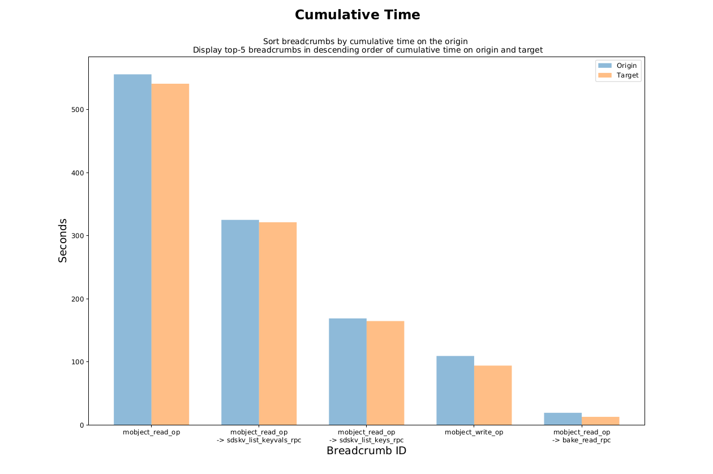
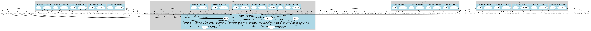

# Margo instrumentation

This file documents instrumentation and profiling capabilities that are built into the
margo library.  See the [top level README.md](../README.md) for general
information about margo.

Margo includes two levels of instrumentation and profiling.  The first (diagnostics) measures time spent
executing key Mercury functions within the communication progress
loop.  The second (breadcrumb profiling) measures time spent invoking remote procedure calls.

## Usage

Note that all instrumentation output files described below will be emitted
in the current working directory of the program by default.  You can specify
an alternative directory with the `MARGO_OUTPUT_DIR` environment variable or
the `output_dir` json parameter.

Diagnostics can be enabled in two ways:
* At program startup, setting the env variable `MARGO_ENABLE_DIAGNOSTICS` to `1`.
* At run time by calling the `margo_diag_start()` any
time after `margo_init()` on the process that you wish to instrument.

Statistics from mercury diagnostics can then be emitted at any time prior to
`margo_finalize()` by calling the `margo_diag_dump()` function. Diagnostics
can be stopped by calling the `margo_diag_stop` on the process. 

Similarly, profiling can by enabled/disabled either by setting the environment
variable `MARGO_ENABLE_PROFILING` to `1` or by using the `margo_profile_start`/`margo_profile_stop`
functions. Statistics from profiling can be output by invoking the `margo_profile_dump`
on the process.

The arguments to `margo_diag_dump()` and `margo_profile_dump` are as follows:
* `mid`: the margo instance to retrieve instrumentation from
* `file`: name of the file to write the (text) data to.  If the "-" string
  is used, then data will be written to `STDOUT`.
* `uniquify`: flag indicating that the file name should be suffixed with
  additional characters to make it unique from other files emitted
  on the same node.
* Diagnostic files have the *.diag suffix for the file name, and 
profile files have the *.csv suffix. 
* If the environment variable is used to control diagnostics/profiling,
all the corresponding files have the default "profile" prefix to the name.
Additionally, the `uniqufy` flag is set, causing the generation of one profile
file for every margo process instance.
 
## Diagnostics Output Format

Example output from `margo_diag_dump()` will look like this for a given
processes:

```
# Margo diagnostics
# Addr Hash and Address Name: 18446744035473536664, ofi+sockets://10.3.1.23:46282
# Tue Oct  8 20:20:08 2019

# Function Name, Average Time Per Call, Cumulative Time, Highwatermark, Lowwatermark, Call Count
trigger_elapsed,0.000000047,2.650168180,0.000000238,0.010999918,56241640
progress_elapsed_zero_timeout,0.000000755,42.434520245,0.000000477,0.129006147,56173943
progress_elapsed_nonzero_timeout,0.000000000,0.000000000,0.000000000,0.000000000,0
```
Key components of the output are:
* The assigned unique network address of the margo instance and its 64-bit hash.
* A set of basic statistics for Mercury functions used to drive communication and
  completion project.  There are counters and elapsed time measurements for
  the `HG_Trigger()` function and the `HG_Progress()` function (when called with
  or without a timeout value, as Margo varies its polling strategy).  There
  is also a category that records statistics about the actual timeout values
  used.
* This file is intended to be read by the end-user directly. 

## Profiling Output Format
```
90
18446744035473536664,ofi+sockets://10.3.1.23:46282
0xdea7,mobject_server_stat
0x9166,mobject_server_clean
0x8bbe,mobject_read_op
0x45b1,mobject_write_op
0x03cb,sdskv_migrate_database_rpc
0xf8d6,sdskv_migrate_all_keys_rpc
0x70d7,sdskv_migrate_keys_prefixed_rpc
0x49e1,sdskv_migrate_key_range_rpc
0x9ce7,sdskv_migrate_keys_rpc
0x2cb7,sdskv_list_keyvals_rpc
0x3598,sdskv_list_keys_rpc
0xf4dc,sdskv_bulk_get_rpc
0x0afa,sdskv_length_multi_rpc
0x5518,sdskv_length_rpc
0x1e99,sdskv_exists_rpc
0xc2bd,sdskv_erase_multi_rpc
0xcaf8,sdskv_erase_rpc
0x98d0,sdskv_get_multi_rpc
0x6488,sdskv_get_rpc
0x8cc0,sdskv_bulk_put_rpc
0xc083,sdskv_put_multi_rpc
0x9695,sdskv_put_rpc
0x4482,sdskv_list_databases_rpc
0x2154,sdskv_count_databases_rpc
0x89b3,sdskv_open_rpc
0xec2c,remi_migrate_end
0x3be8,bake_probe_rpc
0x098f,bake_persist_rpc
...
...
...
0x3be8 ,0.000013113,15336,18446744035473536664,1,0.000013113,0.000013113,0.000013113,1,18446744073709551615,0,0,18446744073709551615,0,0
0x3be8 ,1;0.000013113,1.000000000, 0;0.000000000,0.000000000, 1;0.000013113,1.000000000, 2;0.000000000,0.000000000, 3;0.000013113,1.000000000, 4
0x098f 0x45b1 ,0.011572483,1169230223,18446744035473536664,0,4.397543430,0.008075237,0.020334244,380,18446744073709551615,286331153,0,18446744073709551615,286331153,0
0x098f 0x45b1 ,0;0.000000000,0.000000000, 0;0.000000000,0.000000000, 1;0.000000000,0.000000000, 2;0.000000000,0.000000000, 3;0.000000000,0.000000000, 4
...
...

```
Key components of the output are:
* First line always contains the number of RPC names registered on that process.
* Second line is the assigned unique network address of the margo instance and its 64-bit hash.
* Next, a table of RPC names registered on that process.  Each has a 16 bit
  hexadecimal identifier and a string name.  There may be duplicates in the
  table if the same RPC is registered more than once on the process.
* A set of statistics for each RPC that was issued or received by that margo instance.
  Each RPC will be identified by a set of up to 4 hexidecmial identifiers.  
  The set of identifiers represents a stack that shows the heritage of up to 4 chained RPCS that lead to this
  measurement.  Each identifier will match a name in the table at the top.
  In the above example, statistics are shown for two RPCs (among others in the profile): the "bake_probe_rpc"
  was executed by this server margo process. Additionally, the "bake_persist_rpc" was issued by this server margo process
  that was the side of receiving and executing a "mobject_write_op" request from a client.
* RPC calls made from the margo instance in question to different margo server instances, or issued by different margo client instances
  to the margo instance in question are distinguished in the profile.
  Additionally, the RPC statistic also indicates if it represents a client making a call or a server executing a call.
* Each RPC statistic is associated with 2 consecutive lines in the profile: One containing profiling statistics such as timing information,
  and the other representing information to be used in the generation of a sparkline.
* The user must keep in mind that the profiles only represent the RPC statistics. This is not the same as request tracing.

## Generating a Profile and Topology Graph
While the diagnostic files are simple enough to be read and understood by the user,
the profile files, although readable, represent too much information to be processed
manually. Thus, we have developed a "profile generator" that reads the *.csv files
in the current working directory and generates a PDF file summarizing important 
performance statistics that can help in detecting load imbalance among margo instances,
relative call-counts and calltimes for various RPC breadcrumbs, and so on. 

In order to the generate the PDF summarizing performance, follow these steps:
* Enable profiling in your margo instances (easiest way is to set the `MARGO_ENABLE_PROFILING`
environment variable to `1`).
* Add the $MARGO_INSTALL/bin to your path, and run the MOCHI program. 
* After the program executes, verify that the current directory contains the *.csv files. 
* Invoke the ```margo-gen-profile``` program in the directory containing the *.csv.
  This will generate a ```profile.pdf``` and a ```graph.gv``` file. 
* The ```profile.pdf``` contains a list of graphs summarizing various performance statistics. 
  For example, the following is a graph representing the top-5 breadcrumbs
  sorted by cumulative call times on the origin (client) and the target (server):  
* The ```graph.gv``` file is a ```graphViz``` file that represents a topology graph
  of the MOCHI service setup. This is a visual representation of the RPC calls 
  and location of various margo processes mapped onto the physical system.
  If the user has ```graphViz``` installed, a PNG file can be generated using
  the command ```dot -Tpng graph.gv -o gg.png```, and the resulting image would
  look like: 
